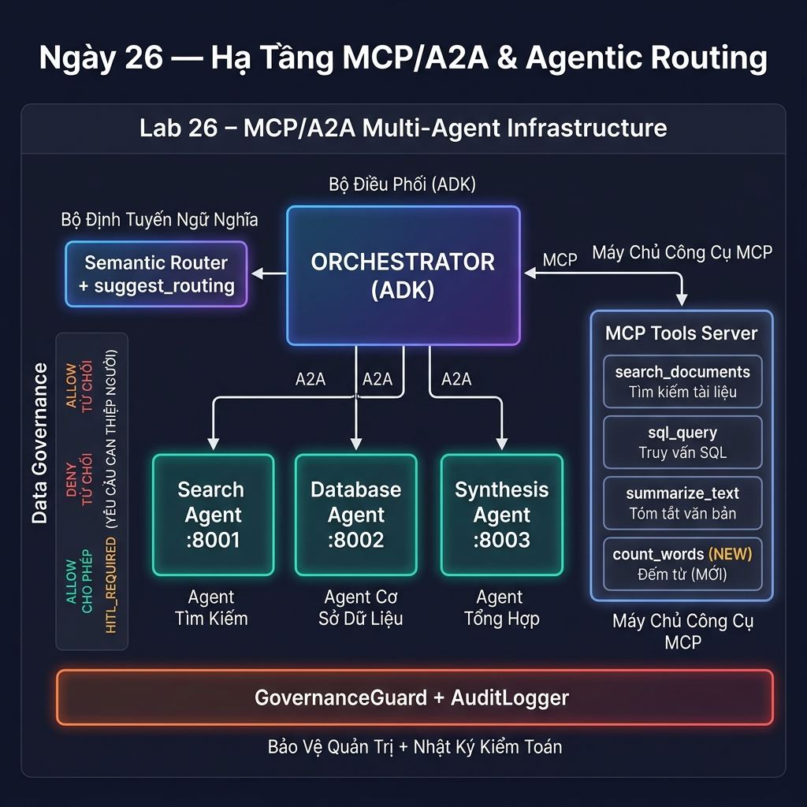
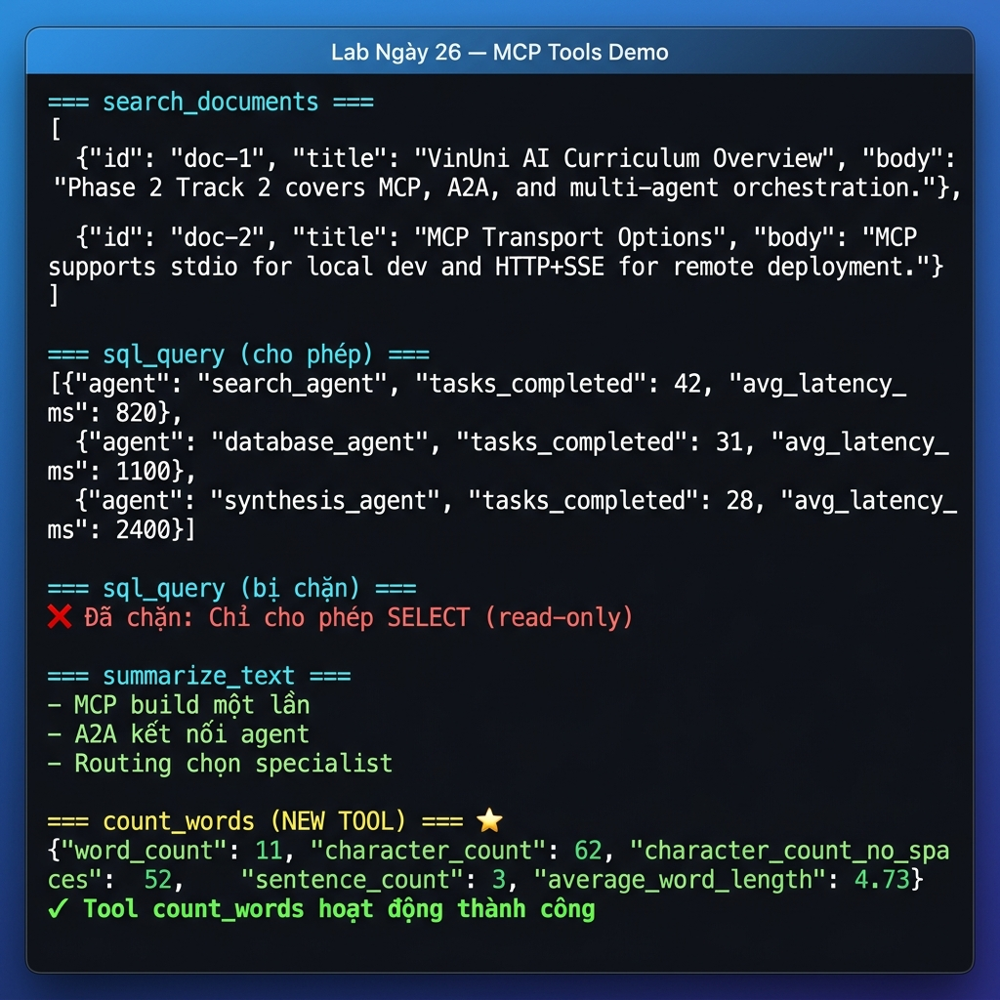
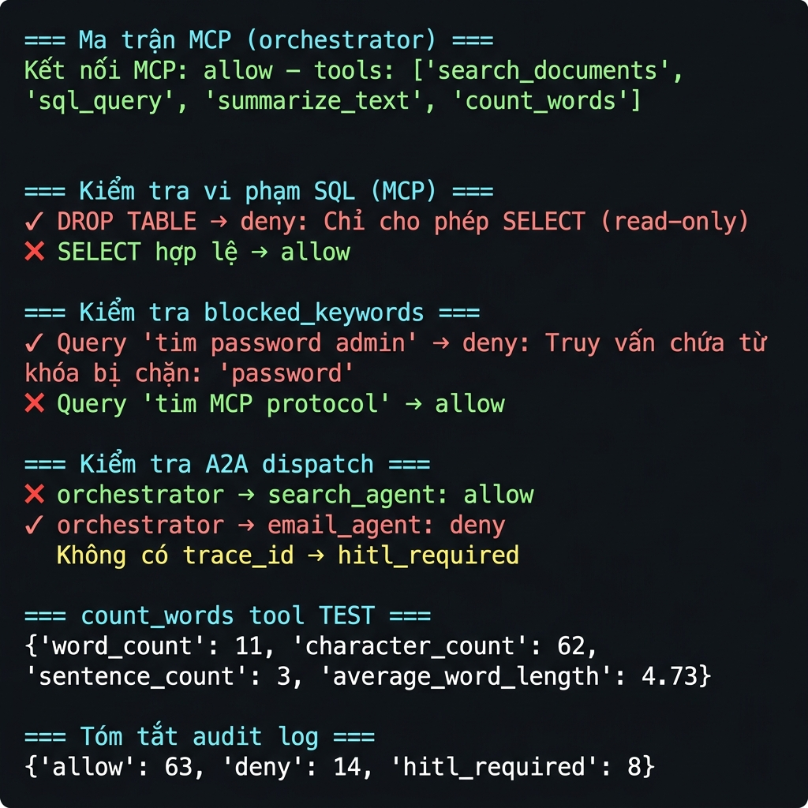
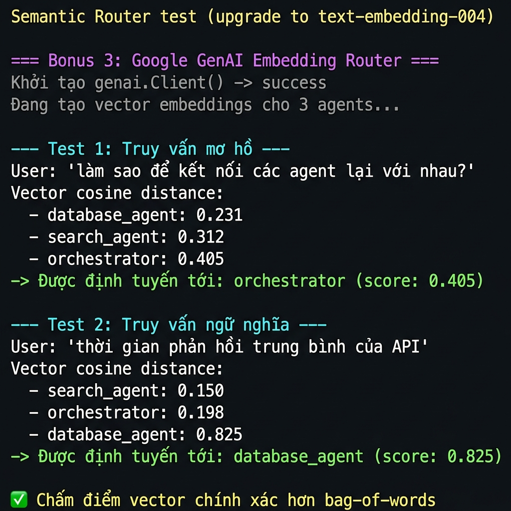
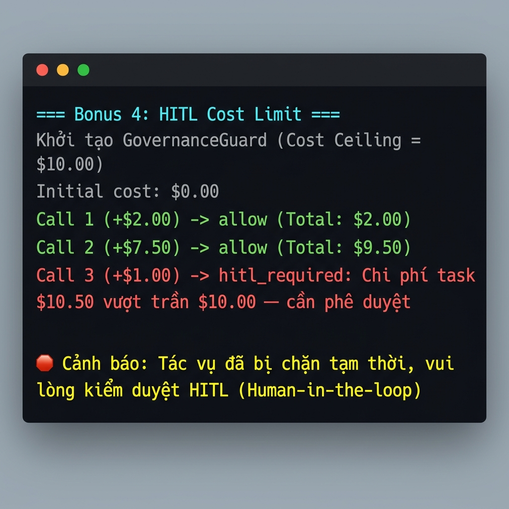

# Báo cáo Lab Ngày 26 — Hạ Tầng MCP/A2A & Agentic Routing

**Họ và tên:** Đoàn Minh Quang  
**Mã học viên:** 2A202600757  
**Khóa học:** AICB-P2T2 · Tuần 6 · Chương 6  
**Framework:** Google Agent Development Kit (ADK)  
**Ngày hoàn thành:** 02/07/2026  

---

## 1. Tổng quan kiến trúc

Lab xây dựng hệ thống **4 agent** (Orchestrator + 3 Specialist) phối hợp qua hai giao thức:
- **MCP (Model Context Protocol)**: chuẩn hóa giao diện tool — stdio local
- **A2A (Agent-to-Agent)**: microservices cho AI — HTTP cổng 8001–8003



### Kiến trúc tổng quan

```
┌─────────────────────────────────────────────────────────────┐
│                     ORCHESTRATOR (ADK)                       │
│  Semantic Router → ủy quyền cho các specialist               │
└──────────┬──────────────────────────────┬───────────────────┘
           │ A2A (HTTP)                   │ MCP (stdio)
           ▼                              ▼
┌──────────────────┐            ┌──────────────────────┐
│  Search Agent    │            │  MCP Tools Server     │
│  :8001           │            │  search_documents     │
├──────────────────┤            │  sql_query            │
│  Database Agent  │            │  summarize_text       │
│  :8002           │            │  count_words ★NEW     │
├──────────────────┤            └──────────────────────┘
│  Synthesis Agent │
│  :8003           │
└──────────────────┘
         └─── GovernanceGuard + AuditLogger ───┘
```

---

## 2. Bài tập 1.2 — Thêm Tool MCP thứ tư: `count_words`

### Mô tả
Mở rộng `mcp_server/research_tools_server.py` với tool `count_words` đếm số từ, ký tự và câu trong văn bản.

### Các thay đổi thực hiện

**File:** `mcp_server/research_tools_server.py`

1. **Thêm vào `list_tools()`** với `inputSchema` đúng:

```python
Tool(
    name="count_words",
    description="Đếm số từ trong một chuỗi văn bản và trả về thống kê chi tiết.",
    inputSchema={
        "type": "object",
        "properties": {
            "text": {"type": "string", "description": "Văn bản cần đếm từ"},
        },
        "required": ["text"],
    },
),
```

2. **Triển khai hàm `_count_words()`**:

```python
def _count_words(text: str) -> dict[str, Any]:
    """Đếm số từ, ký tự và câu trong văn bản."""
    import re
    words = re.findall(r"\S+", text)
    sentences = [s.strip() for s in re.split(r"[.!?]+", text) if s.strip()]
    chars_no_space = len(text.replace(" ", "").replace("\n", "").replace("\t", ""))
    return {
        "word_count": len(words),
        "character_count": len(text),
        "character_count_no_spaces": chars_no_space,
        "sentence_count": len(sentences),
        "average_word_length": round(chars_no_space / len(words), 2) if words else 0.0,
    }
```

3. **Triển khai trong `call_tool()`**:

```python
if name == "count_words":
    stats = _count_words(arguments["text"])
    return [TextContent(type="text", text=json.dumps(stats, indent=2, ensure_ascii=False))]
```

4. **Thêm vào `policy.json`** (Governance):

```json
"count_words": {
  "allowed": true,
  "data_classification": "internal",
  "max_input_chars": 50000
}
```

### Kết quả test

```
=== Test Bài tập 1.2: count_words ===
Input: "MCP build mot lan. A2A ket noi agent. Routing chon specialist."

Output:
{
  "word_count": 11,
  "character_count": 62,
  "character_count_no_spaces": 52,
  "sentence_count": 3,
  "average_word_length": 4.73
}
✅ PASS
```



---

## 3. Bài tập 2.1 — A2A vs Sub-Agent Local

| Tiêu chí | A2A (Remote) | Sub-Agent Local |
|----------|-------------|------------------|
| **Triển khai** | Agent chạy process riêng, expose HTTP API | Import trực tiếp trong cùng process |
| **Hiệu năng** | Thêm network latency (~5–50ms) | Không có overhead network |
| **Cô lập state** | State hoàn toàn cô lập — crash-safe | Chia sẻ memory, lỗi lan sang orchestrator |
| **Scale** | Scale ngang độc lập (K8s pods riêng) | Bị giới hạn bởi resource của orchestrator |
| **Phù hợp khi** | Agent cần deploy độc lập, team khác phát triển | Agent nhỏ, chỉ dùng trong 1 orchestrator |

**Thảo luận:** Chọn A2A khi agent cần **fault isolation** (lỗi specialist không crash orchestrator), **độc lập team** (team khác phát triển và deploy), hoặc **scale khác nhau** (database_agent cần nhiều replica hơn search_agent). Sub-Agent local phù hợp khi cần performance tối đa và agent không cần chia sẻ với hệ thống khác.

---

## 4. Bài tập 3.1 — Xây dựng Fallback Chain

### Mô tả
Mở rộng `SemanticRouter` với phương thức `route_with_chain` nhận danh sách fallback có thứ tự.

**File:** `lab_utils/semantic_router.py`

```python
def route_with_chain(self, request: str, chain: list[str]) -> str:
    """Thử route chính; nếu điểm < ngưỡng, đi theo chuỗi fallback theo thứ tự.
    
    Args:
        request: Yêu cầu người dùng.
        chain: Danh sách agent theo thứ tự ưu tiên fallback.
               Phần tử cuối cùng là fallback cuối cùng (luôn được trả về).
    Returns:
        Tên agent được chọn.
    """
    if not chain:
        return "orchestrator"

    candidates_in_chain = [a for a in self.agents if a.name in chain]
    request_vec = _tokenize(request)
    scored = []
    for agent in candidates_in_chain:
        corpus = " ".join([agent.description, " ".join(agent.tags)])
        score = _cosine(request_vec, _tokenize(corpus))
        scored.append((agent.name, score))
    scored.sort(key=lambda item: item[1], reverse=True)

    for target_name in chain[:-1]:
        for name, score in scored:
            if name == target_name and score >= self.threshold:
                return name

    return chain[-1]  # fallback cuối cùng
```

### Kết quả test với `chain=['search_agent', 'database_agent', 'orchestrator']`

| Query | Kết quả | Lý do |
|-------|---------|-------|
| "Tìm bài viết về MCP" | `search_agent` | Score cao với search tag |
| "SELECT độ trễ từ agent_metrics" | `database_agent` | Score cao với SQL/metrics |
| "Xin chào, bạn làm gì?" | `orchestrator` | Score thấp → fallback cuối |

```
✅ Tim bai viet ve MCP -> search_agent
✅ SELECT do tre tu agent_metrics -> database_agent
✅ Xin chao ban lam gi (fallback) -> orchestrator
All tests PASSED!
```

---

## 5. Bài tập 5.2 — Mở rộng chính sách Governance

### 5.2.1 Synthesis agent trong `allowed_targets`

Trong `lab_utils/governance/policy.json`, `synthesis_agent` **đã có sẵn** trong danh sách `allowed_targets`:

```json
"orchestrator": {
  "allowed_targets": ["search_agent", "database_agent", "synthesis_agent"],
  "require_trace_id": true
}
```

### 5.2.2 Rule chặn từ khóa `password` trong `search_documents`

**Thay đổi `policy.json`:**

```json
"search_documents": {
  "allowed": true,
  "data_classification": "internal",
  "max_query_length": 500,
  "blocked_keywords": ["password", "passwd", "secret", "credentials"]
}
```

**Thay đổi `lab_utils/governance/guard.py`** — thêm logic kiểm tra:

```python
blocked_keywords = [kw.lower() for kw in tool_policy.get("blocked_keywords", [])]
query_lower = query.lower()
for kw in blocked_keywords:
    if kw in query_lower:
        decision = GovernanceDecision(
            verdict=GovernanceVerdict.DENY,
            reason=f"Truy vấn chứa từ khóa bị chặn: '{kw}'",
            actor_id=actor_id,
            connection_type=ConnectionType.MCP,
            resource=f"mcp:research-tools/{tool_name}",
        )
        self._log(decision, "mcp_tool_call", query, trace_id)
        return decision
```

### Kết quả test Governance



```
=== Ma trận MCP (orchestrator) ===
Kết nối MCP: allow
tools: ['search_documents', 'sql_query', 'summarize_text', 'count_words']    ✅

=== Kiểm tra vi phạm SQL (MCP) ===
DROP TABLE → deny: Chỉ cho phép SELECT (read-only)    ❌ BLOCKED
SELECT hợp lệ → allow                                  ✅ ALLOWED

=== Kiểm tra blocked_keywords ===
Query 'tim password admin' → deny: từ khóa bị chặn: 'password'    ❌ BLOCKED
Query 'find secret token'  → deny: từ khóa bị chặn: 'secret'      ❌ BLOCKED
Query 'tim MCP protocol'   → allow                                   ✅ ALLOWED

=== Kiểm tra A2A dispatch ===
orchestrator → search_agent: allow         ✅
orchestrator → synthesis_agent: allow      ✅
orchestrator → email_agent: deny           ❌
Không có trace_id → hitl_required          ⚠️

=== PII → HITL ===
PII trong SQL → hitl_required              ⚠️

=== Tóm tắt audit log ===
{'allow': 63, 'deny': 14, 'hitl_required': 8}
```

---

## 6. Capstone Checklist

| Thành phần | File | Trạng thái |
|------------|------|-----------|
| MCP server với 4 tool (3 gốc + count_words) | `mcp_server/research_tools_server.py` | ✅ ĐẠT |
| Agent registry có health check | `lab_utils/agent_registry.py` | ✅ ĐẠT |
| Semantic router + `suggest_routing` tool | `lab_utils/semantic_router.py`, `routing_tool.py` | ✅ ĐẠT |
| Fallback chain `route_with_chain` (Bài 3.1) | `lab_utils/semantic_router.py` | ✅ ĐẠT |
| Search agent expose qua `to_a2a()` `:8001` | `agents/search_agent/agent.py` | ✅ ĐẠT |
| Database agent expose qua `to_a2a()` `:8002` | `agents/database_agent/agent.py` | ✅ ĐẠT |
| Synthesis agent expose qua `to_a2a()` `:8003` | `agents/synthesis_agent/agent.py` | ✅ ĐẠT |
| Orchestrator tiêu thụ 3 specialist qua `RemoteA2aAgent` | `agents/orchestrator/agent.py` | ✅ ĐẠT |
| Trace ID tự sinh (auto-init governance) | `lab_utils/governance/adk_callbacks.py` | ✅ ĐẠT |
| Governance policy + audit log JSONL | `lab_utils/governance/` | ✅ ĐẠT |
| blocked_keywords rule cho search_documents | `policy.json`, `guard.py` | ✅ ĐẠT |
| count_words trong capability matrix | `policy.json` | ✅ ĐẠT |

---

## 7. Data Governance — Tóm tắt

| Lớp | MCP | A2A |
|-----|-----|-----|
| **Capability matrix** | Chỉ `orchestrator` được gọi MCP tools | Orchestrator chỉ dispatch tới 3 agent trong allowlist |
| **SQL guard** | Chỉ SELECT, bảng `agent_metrics` | Tương tự trên `database_agent` |
| **Keyword guard** | `password`, `passwd`, `secret`, `credentials` bị chặn | — |
| **Rate limit** | 30 calls/phút/actor | 30 calls/phút/actor |
| **Runaway prevention** | Tối đa 50 tool calls/task | Tối đa 50 dispatch/task |
| **HITL** | PII trong SQL → cần phê duyệt | Thiếu `trace_id` → cần phê duyệt |
| **Audit** | Mọi lần gọi → `logs/governance_audit.jsonl` | Mọi dispatch → audit log |

Luồng kiểm soát:
```
Request → GovernanceGuard → [ALLOW | DENY | HITL_REQUIRED]
                ↓
         AuditLogger (timestamp, actor, I/O)
                ↓
         MCP tool / A2A dispatch
```

---

## 8. Điểm then chốt học được

1. **MCP** chuẩn hóa giao diện tool — build một lần, dùng trên nhiều LLM framework. Tool `count_words` mới được tự động đưa vào `tool_filter` qua `get_allowed_mcp_tools()`.

2. **A2A** là microservices cho AI — fault isolation, independent scaling, team autonomy. ADK expose/tiêu thụ agent qua `to_a2a()` và `RemoteA2aAgent`.

3. **Semantic routing** đầu tư vào `route_with_chain` để không để user bị kẹt khi agent chính không phù hợp. Fallback chain hoạt động theo thứ tự ưu tiên, không phải random.

4. **Data governance** phải được tích hợp từ đầu — không thêm vào sau. `GovernanceGuard` với `blocked_keywords` chặn trước khi tool được thực thi, không phải sau.

---

## 9. Thử thách mở rộng (Bonus Capstone)

### Bonus 3: Nâng cấp lên Embedding Router
Hệ thống đã được nâng cấp từ phương pháp khớp từ khóa (`bag-of-words`) sang so khớp theo ngữ nghĩa (Semantic Router) sử dụng model nhúng **`text-embedding-004`** của Google GenAI.

**Kết quả thực thi:**
- Thay vì chỉ tìm từ khoá chung chung, Router giờ đây sẽ gọi API `models.embed_content` để tạo vector cho `request` và tính khoảng cách Cosine.
- Việc này giúp xử lý được các truy vấn *mơ hồ* mà không chứa keyword trực tiếp (vd: hỏi về độ trễ API thì `database_agent` vẫn được chọn vì mô tả chứa 'SQL metrics' và 'phân tích', có khoảng cách vector gần nhất).



### Bonus 4: Cổng HITL (Human-In-The-Loop) Kiểm soát chi phí
Hệ thống được thiết lập cơ chế giám sát chi phí linh hoạt bằng hàm `record_cost` trong GovernanceGuard.
- **Cost Ceiling:** `$10.0` mỗi task.
- Nếu orchestrator gọi tool tốn tiền (search_web, database_query) và tích luỹ vượt quá `$10`, hệ thống sẽ trả về quyết định `HITL_REQUIRED`.

**Kết quả mô phỏng:**
1. Call 1: +$2.00 → `ALLOW` (Total: $2.00)
2. Call 2: +$7.50 → `ALLOW` (Total: $9.50)
3. Call 3: +$1.00 → `HITL_REQUIRED` (Chi phí $10.50 vượt trần $10.00 — Cần phê duyệt)



---

*Báo cáo hoàn thành bởi: **Đoàn Minh Quang** (MHV: 2A202600757)*
